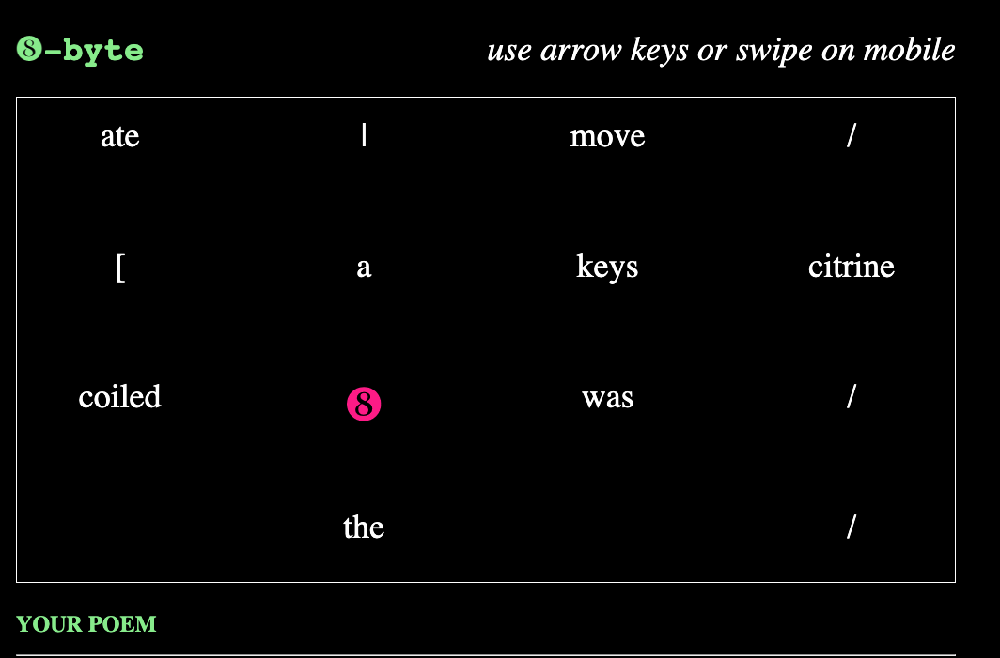

# Pacman poem

This was originally created as a submission for the 8th issue of <a href="taper.badquar.to">taper</a>, a computational poetry journal alongside Kelsey Chen, who helped with the design of the game and the word bank.

Copied below our creative statement for the submission:

An 8-ball is reimagined as an 8-bit game reimagined as a poetry machine. Readers play the game using their arrow keys to move the 8-ball around to consume words. Rather than collecting points like in Pacman, readers eat words and punctuations to create their own poem, which automatically fills in the space below the grid. The grid is filled with a select number of random words from a pre-filled work bank for each part of speech, including punctuation, and the game is over when all words have been consumed. Replay variety is amplified through randomization and words that multitask in sentence function (e.g. as both verb and noun), despite a limited word bank. Toying with consumption (eight=ate), luck (8-ball), constraint (the 4 directions), and poetic composition (with 8 words in a grid of 16), 8-Bite is a playful poetic contraption that literally makes you eat your words.

How do you win a game of poetry? What happens when luck is a functional constraint on beauty? What does it mean to create poetry by eating your words (taking things back) in an irretractable gameplay?

---

The version hosted on my website is an expanded version that stores your history of games in your local browser storage and allows you to submit to a public gallery. This also builds in historical information about the state of the board and the moves taken, so you can imagine taking someone else's word bank to "seed" a game for you to play with. I'm imagining trading game cartridges and how it felt when you connected to someone else on LAN with your Gameboy to trade Pokemon.
